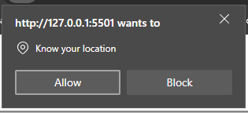
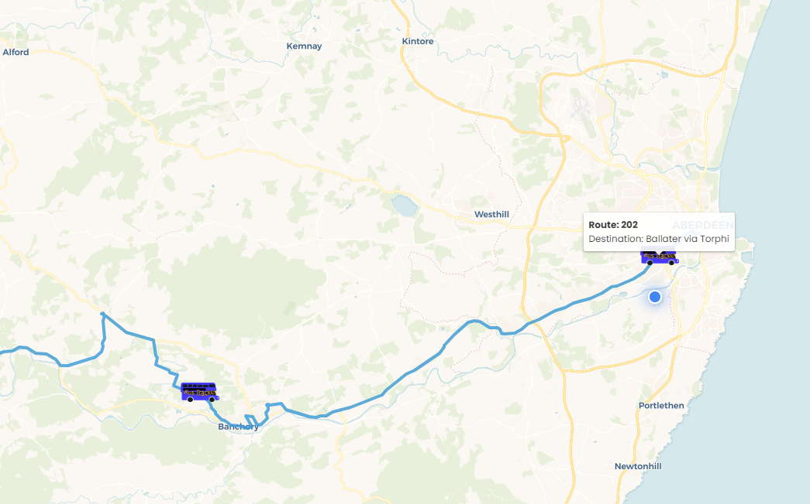
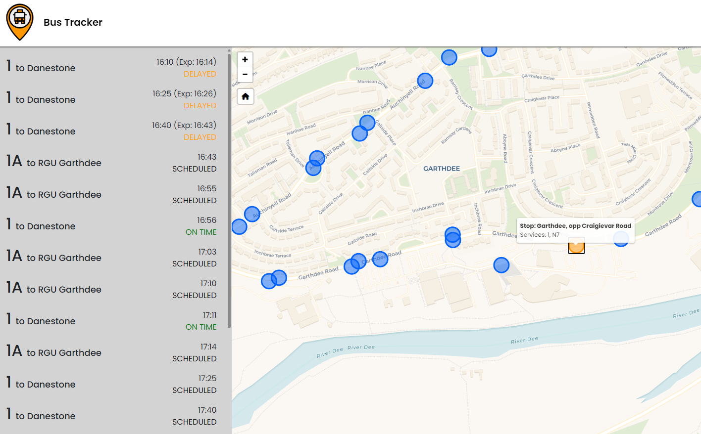

# CM2104 Group Project Repository

An easy to use bus tracker website for buses in the UK. Tailored specifically to visualise buses within Scotland + Aberdeen.

## Contributors

- Owen Meade (2310873) [@owenrgu](https://github.com/owenrgu)
- Ethan Saum (2304185) [@saumethan](https://github.com/saumethan)
- Joshua Newton (2308183) [@JoshuaNewton-rgu](https://github.com/JoshuaNewton-rgu)
- Xavier Flockton (2328017) [@XavierFlockton](https://github.com/XavierFlockton)

## Live Preview

View our live site here: https://bus-tracker.co.uk

Watch the demo video below for a tutorial of how to use the site, a brief overview of some hidden functionalities, and an explanation of the technical challenges we had to solve whilst developing the site.

https://github.com/user-attachments/assets/4d03246b-e016-4f0a-8103-c58f62209a84

## Site Instructions

When you first load the page, allow it to access your location so it can plot you on the map. You should then accept the Cookies popup so your last known location can be saved. This allows the website to load at your last location while it’s getting your new location. 

The bus images on the map are the live locations of buses. The icon shows the operator logo, route number and the direction the bus is facing. You can hover over each bus to see more information such as the destination. If you click on a bus, the route will be shown, along with all the other buses following that route. To stop viewing a route, click the Home button on the right of the map or click the webpage back button.

Another way of viewing a route is with the search bar in the right panel. This searches for the closest bus route to your current location, with the same route number. Try searching for the 1A over Aberdeen!

The live locations of the buses will update:
•	Every 15 seconds
•	When you click the Refresh button on the right of the map
•	When you zoom or move the map to a new location where buses were not already loaded

Zoom further into the map to see red dots which are locations of bus stops in your current map area. Hover over these red dots to see the stop name and routes that serve the stop and click on them to see a list of live times for the buses serving that stop. The panel on the left will also show you whether a bus is early, scheduled, delayed or cancelled. If you click on a bus in the bus stop data panel, the route and buses on that route will be shown on the map. To get out of a current stop and clear the panel, click the Home button on the right of the map or click the browser back button.

If you want to see how long it will take to walk a specific bus stop from your current location, first click on the stop, then click the walk icon on the top right of the map. This will draw the specific route to the stop, as well as show the distance and time taken to walk this route.

If you want to change settings, be sure to create and login to your account. Once logged in, the settings page will show in the nav bar under your user icon. In settings, you can change the default map zoom, logout, change password or delete your account. You can also sign out of your account using the button in the nav bar. 

The site has a different look on mobile and has additional functionality such as a resizable bus data panel. Check it out on a mobile device for the best results, but if testing with Chrome Dev Tools, make sure to refresh the page after switching to the phone emulator.

Report bugs in the Issues section of this repository or to our emails.
