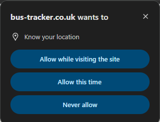
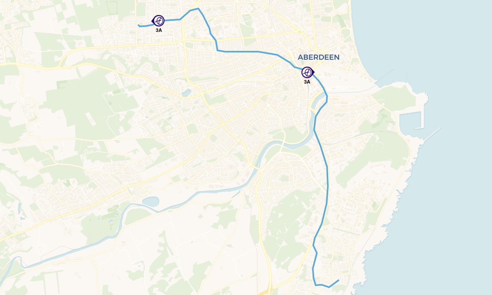
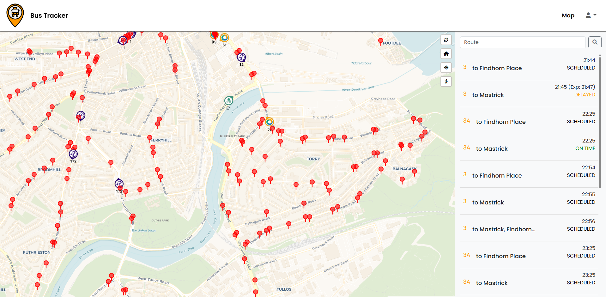

# TODO List

- ADD IN STOP LAT AND LON when a bus is clicked on in the stops

# CM2104 Group Project Repository

An easy to use bus tracker website for buses in the UK. Tailored specifically to visualise buses within Scotland + Aberdeen.

## Contributors

- Owen Meade (2310873) [@owenrgu](https://github.com/owenrgu)
- Ethan Saum (2304185) [@saumethan272](https://github.com/saumethan272)
- Joshua Newton (2308183) [@JoshuaNewton-rgu](https://github.com/JoshuaNewton-rgu)
- Xavier Flockton (2328017) [@XavierFlockton](https://github.com/XavierFlockton)

## Live Preview

View our live site here: https://cm2104-dynamicwebdevelopment.github.io/cm2104-2425-groupproject-gooey-penguins/prototype/index.html

## Site Instructions

When you first load the page, allow it to access your location so it can plot you on the map. 

The bus images on the map are live locations of buses. You can hover over them to see the bus route name and destination and click on them to see the route they're following (and all the other buses following that route). To get out of a route, click the Home button on the left of the map.

The locations of the buses will update:
- Every 30 seconds
- When you click the Refresh button on the right of the map
- When you zoom or move the map

Zoom further into the map to see red dots which are locations of bus stops in your current map area. Hover over these red dots to see the stop name and routes that serve the stop and click on them to see a list of live times for the buses serving this stop. The panel on the left will also show you whether a bus is delayed or cancelled. To get out of a current stop, click the Home button on the left of the map.

The timetables page (accessed in the navigation bar) allows you to select an operator (currently only First Bus is supported but Stagecoach will be supported next semester) and enter other information to generate a PDF timetable of your bus. Try the 1 to RGU!

## Future Enhancements

We have identified several future enhancements we can make to the site to make it better:

- Auto updating user location
- Show bus route names onto markers
- Add a search bar to search for specific bus routes on the map
- Allow the bus data panel to be resized on mobile

## Known Bugs

These bugs are known and being worked on:

- When you double click on a bus route, the route disappears and you have to click Home to get out of the route.

Report bugs in the Issues section of this repository or to our emails.

## Easter Eggs

Explore some "extra features" in our website 😜
- Click on your user profile ---> buses (only shows on the Map page)
- Click the footer text to access our secret page

